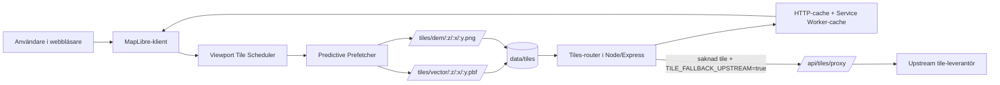

# Sverige 3D-karta med SMHI-väder

Högupplöst 3D-karta över Sverige med live väderdata från SMHI.

## Krav

| Krav | Minimum | Rekommenderat |
|------|---------|---------------|
| **Node.js** | 18.0.0 | 20 LTS eller 22 LTS |
| **npm** | Medföljer Node.js | – |
| **Internet** | Krävs | – |
| **Webbläsare** | Modern (Chrome, Firefox, Edge) | Chrome |

### Kontrollera att Node.js är installerat

Öppna en terminal (Kommandotolken, PowerShell, eller Terminal på macOS/Linux) och skriv:

```bash
node -v
```

Du bör se något i stil med `v20.11.1`. Om kommandot inte hittas eller versionen är lägre än `v18`, installera senaste LTS-versionen från [nodejs.org](https://nodejs.org/).

Kontrollera även att npm finns:

```bash
npm -v
```

## Starta appen – steg för steg

### 1. Klona repot

Öppna en terminal och navigera till den mapp där du vill spara projektet:

```bash
cd ~/projekt
```

Klona sedan repot:

```bash
git clone https://github.com/theoandesson/cursor.git
```

Gå in i projektmappen:

```bash
cd cursor
```

### 2. Hämta senaste versionen (main)

Använd alltid `main` för aktuell och stabil kod:

```bash
git checkout main
git pull origin main
```

### 3. Installera beroenden

Installera alla npm-paket som projektet behöver:

```bash
npm install
```

Du ska se något liknande:

```
added 75 packages in 1s
```

Om du får felmeddelanden, se [Felsökning](#felsökning) nedan.

### 4. Starta servern

```bash
npm start
```

Du ska se detta i terminalen:

```
Sverige 3D-karta startad: http://127.0.0.1:4173
LOD: låg detalj vid rörelse, hög detalj i idle.
```

**Webbläsaren öppnas automatiskt.** Om den inte öppnas, kopiera länken ovan och klistra in i din webbläsare.

> **Tips:** Vill du använda en annan port? Kör med miljövariabeln `PORT`:
>
> ```bash
> PORT=3000 npm start
> ```
>
> Vill du stänga av att webbläsaren öppnas automatiskt?
>
> ```bash
> AUTO_OPEN_BROWSER=false npm start
> ```

### 5. Använd appen

- **Zooma in/ut** – scrollhjul, `+`/`-` tangenter, dubbelklick, eller knapparna uppe till vänster
- **Panorera** – klicka och dra med musen
- **Rotera/luta/flytta** – använd knapparna `R-`/`R+` (rotation), `L-`/`L+` (lutning) och `N/V/O/S` (förflyttning)
- **Navigeringspanel** – använd pilarna (förflyttning), `↺`/`↻` (rotation), `Tilt -`/`Tilt +` (lutning) och `⌂` (återställning)
- **Inverterad styrning** – växla med knappen `Inverterad: På/Av` i navigeringspanelen
- **Se väder** – markörer visas automatiskt för 70+ svenska städer
- **Klicka var som helst** på kartan för detaljerad väder-popup med 6-timmars prognos

## Stoppa servern

Tryck `Ctrl + C` i terminalen.

## Ambitiöst läge (self-hosted tiles)

Det här läget kör tile-flödet lokalt från `data/tiles` för bättre kontroll över latens, cache och drift.

### 1. Synka tile-data till `data/tiles`

Kör synk före start:

```bash
npm run tiles:sync
```

Målet är att fylla `data/tiles` med den lokala tile-strukturen som `/tiles/*`-endpoints läser från.

### 2. Styr läge med miljövariabler

Aktivera self-hosted tile-läge:

```bash
SELF_HOSTED_TILES=true npm start
```

Hybridläge med fallback till upstream vid saknade lokala tiles:

```bash
SELF_HOSTED_TILES=true TILE_FALLBACK_UPSTREAM=true npm start
```

Ren self-hosted utan upstream-fallback:

```bash
SELF_HOSTED_TILES=true TILE_FALLBACK_UPSTREAM=false npm start
```

### 3. Bygg produktionsbundle

Skapa produktionsanpassad bundle:

```bash
npm run build
```

### Arkitektur: self-hosted tile-flöde



## NPM-skript

| Script | Syfte |
|--------|-------|
| `npm start` | Startar applikationen lokalt. |
| `npm run build` | Bygger produktionsbundle för client/server-flödet. |
| `npm run tiles:sync` | Synkar/uppdaterar lokala tiles till `data/tiles`. |
| `npm run test:tiles` | Verifierar tile-infrastruktur, lokala tiles och fallback-regler. |
| `npm run smoke` | Enkel end-to-end-kontroll av server och health-endpoint. |
| `npm run test:unit` | Kör utvalda enhetstester. |
| `npm run test:full` | Kör en större testsekvens för appflöden. |
| `npm run test:benchmark` | Kör benchmark för API-prestanda. |

Se även [docs/AMBITIOUS_TILE_INFRA.md](docs/AMBITIOUS_TILE_INFRA.md) för tekniska detaljer.

## Smoke-test

```bash
npm run smoke
```

Verifierar att servern fungerar och att health-endpoint svarar.

## API-endpoints

Servern exponerar även ett API som klienten använder för stad- och väderdata:

- `GET /api/healthz` – API-status
- `GET /api/endpoints` – lista alla tillgängliga API-endpoints
- `GET /api/cities` – lista svenska städer (stöd för `search`, `limit`, `offset`)
- `GET /api/cities/:cityId` – hämta en enskild stad
- `GET /api/weather/point?lon=<lon>&lat=<lat>&hours=<1-48>` – väder för valfri punkt
- `GET /api/weather/cities` – väder för alla städer (`refresh=true` för forcad uppdatering)
- `GET /api/weather/cities/:cityId` – väder för en specifik stad

Exempel:

```bash
curl "http://127.0.0.1:4173/api/cities?limit=20"
curl "http://127.0.0.1:4173/api/weather/cities?limit=10"
curl "http://127.0.0.1:4173/api/weather/point?lon=18.0686&lat=59.3293"
```

## Felsökning

### "command not found: node" eller "node is not recognized"

Node.js är inte installerat. Ladda ner det från [nodejs.org](https://nodejs.org/) (välj LTS-versionen).

### "SyntaxError: Cannot use import statement outside a module"

Din Node-version är för gammal. Uppgradera till Node.js 18 eller nyare:

```bash
node -v
```

### "EADDRINUSE: address already in use"

Port 4173 används redan. Antingen stäng programmet som använder porten, eller kör med en annan port:

```bash
PORT=3000 npm start
```

### "npm install" ger fel

Försök rensa npm-cache och installera om:

```bash
rm -rf node_modules package-lock.json
npm install
```

### Kartan laddas inte / vit sida

- Kontrollera att du har internetanslutning (kartdata laddas från externa servrar)
- Öppna webbläsarens utvecklarverktyg (`F12`) och kolla Console-fliken för felmeddelanden
- Testa att ladda om sidan med `Ctrl + Shift + R`

### Väderdata visas inte

- SMHI API kräver internetanslutning
- API:et fungerar bara för koordinater inom Sverige
- Kontrollera Console-fliken i utvecklarverktygen (`F12`) för eventuella nätverksfel
